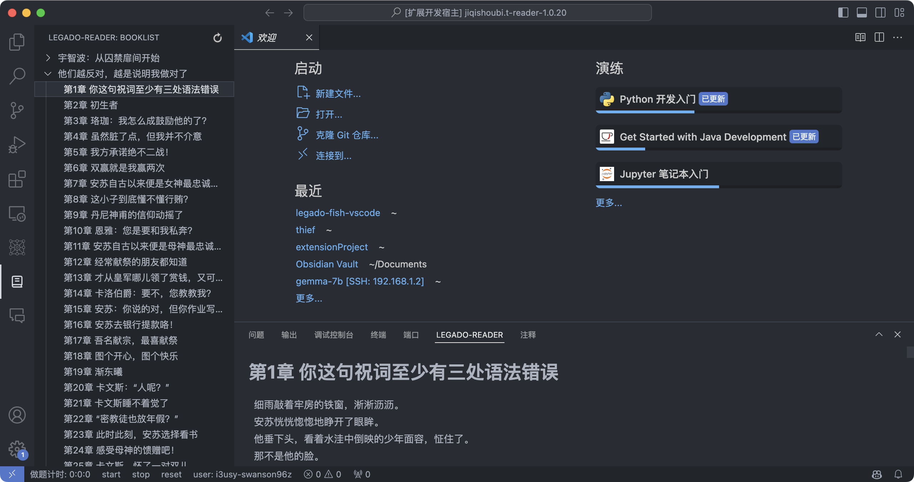
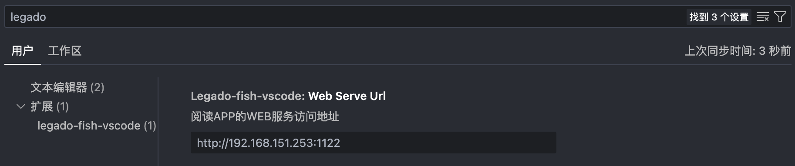
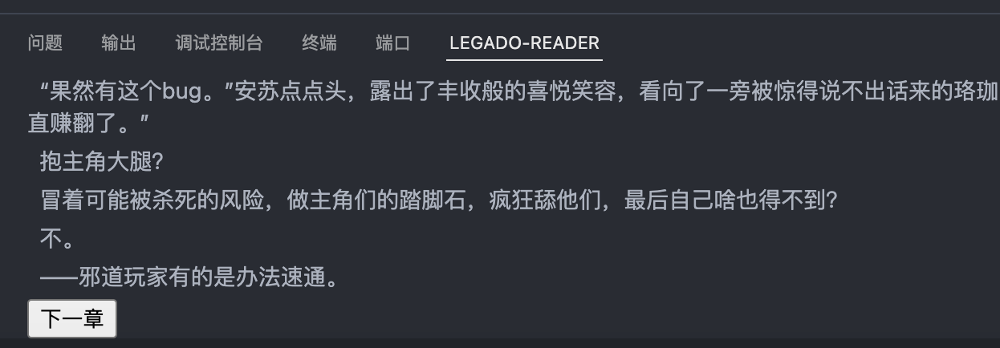

# legado/开源阅读   vscode插件

> 可基于开源阅读app端或docker端在vscode下方的控制台阅读小说

## 介绍

* 基于开源阅读web api开发
* 侧边栏选择书籍和章节
* 控制台显示章节内容
* 章节结束可点击按钮跳转到下一章

## 使用步骤

1. 打开阅读app中的web服务，将手机和电脑连接到同一网络下

2. 在vscode setting中搜索legado-fish-vscode，配置服务器地址,默认为127.0.0.1:1122

   

3. 点击侧边栏按钮，如果设置正确，将展示app内书籍列表，展开后显示章节名

4. 如下方控制台隐藏，请提前打开

5. 点击章节名，即可在下方控制台进行阅读（**如果APP内没有内容缓存，控制台中也不会显示，所以请确保APP中有小说内容，书源切换也请在APP中进行，完成后可在侧边栏右上角刷新**）

6. 单章阅读完成后可点击按钮跳到下一章

   

## 下一步工作

* 进度保存
* 界面美化
* 本地小说支持
* 在线书籍搜索与添加
* 快捷键
* 性能优化
* ……

## 相关链接

Github:https://github.com/hukq16/legado-fish-vscode

Issue:https://github.com/hukq16/legado-fish-vscode/issues

Legado:https://github.com/gedoor/legado

VScode Marketplace:https://marketplace.visualstudio.com/items?itemName=keeganhu.legado-fish-vscode#review-details

免责声明:https://gedoor.github.io/Disclaimer

